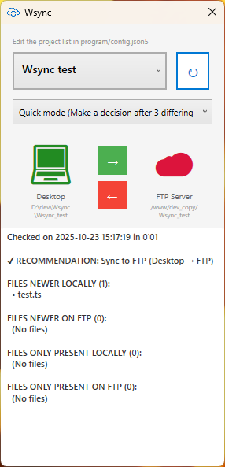

# Wsync - File Sync Utility

A tiny, minimal Windows desktop application for synchronizing files between your local desktop and an FTP/SFTP server.

## Features

- 🖥️ Clean, minimal UI - quickly see sync status at a glance
- 📋 Easy per-project configuration - manage multiple projects
- 🚀 Portable - no installation needed, can run from a USB key
- 🪶 Super lightweight - less than 2 MB
- 🔄 Bi-directional file sync (Desktop ↔ FTP/SFTP)
- 🎯 Multiple analysis modes:
  - **Full**: Analyzes all files recursively
  - **Quick**: Analyzes only root + 1 level deep (fast decision)
  - **Git**: Compares latest git commits
- ⚡ Fast timestamp-based comparison (no hashing)
- 🔒 Credentials stored securely (local config file)

<div align="center">
  
</div>

## How to Run

1. **Create a configuration file:**
   - Rename `config.example.json5` to `config.json5` in the `program/` directory
   - Edit it (in a text editor) with your FTP/SFTP server details and project paths

2. **Launch the application:**
   - Double-click `program/Wsync.exe`

3. **Sync your files:**
   - Select a project from the dropdown
   - Choose your sync direction (Full/Quick/Git mode)
   - Click the corresponding arrow button to sync in the desired direction

That's it! The app will analyze sync status and sync your files.

## Configuration

### Configuration File Structure

Edit `config.json5`:

```json5
{
  projects: [
    {
      name: "project 1", // As displayed in the projects list
      localPath: "D:\\dev\\project1", // Full path to your local project folder
      ftpRemotePath: "/work/dev/project1", // Remote path on the FTP server
    },
    {
      name: "project 2",
      localPath: "D:\\architecture\\project2",
      ftpRemotePath: "/work/project2",
    },
  ],

  ftp: {
    host: "11.22.33.44",
    port: 22, // Use 21 for standard FTP, 22 for SFTP
    username: "user",
    password: "pwd",
    passiveMode: false, // Usually true for FTP connections
    secure: true, // Set to true to use SFTP (SSH) instead of FTP
  },
  excludedExtensions: ["qzx", "zxq", "jqv", "vqx"],
  excludedFolders: ["doNotSyncThisFolder"], // just folder names, without paths
}
```

### Configuration Tips

- **LocalPath**: Full path to your local project folder
- **FtpRemotePath**: Remote path on the FTP server
- **Secure**: `true` for SFTP (SSH), `false` for standard FTP
- **ExcludedExtensions**: File types to skip during analysis (without dots)
- **ExcludedFolders**: Folders to skip during analysis

---

## (OPTIONAL) Building the App (for Developers)

### Prerequisites
- .NET 8 SDK
- Visual Studio 2022 or Visual Studio Code

### Build from Source

```powershell
cd source
dotnet build
```

### Run Locally

```powershell
cd source
dotnet run
```

### Publish as Standalone EXE

Create a self-contained, standalone executable:

```powershell
cd source
dotnet publish -c Release -r win-x64 --self-contained
```

The executable will be in `bin/Release/net8.0-windows/win-x64/publish/Wsync.exe`

### Project Structure

```
source/
  ├── App.xaml / App.xaml.cs          # Application entry point
  ├── MainWindow.xaml / MainWindow.xaml.cs  # Main UI
  ├── Wsync.csproj                    # Project file
  └── Services/
      ├── ConfigService.cs            # Config loading/saving
      └── FtpService.cs               # SFTP/SSH file comparison
  └── Models/
      └── ProjectConfig.cs            # Data models
```

### ⚠️ Important Security Notes

**DO NOT COMMIT `config.json5`** - This file contains your FTP/SFTP credentials!

The file is already ignored by git (see `.gitignore`), but be extra careful:
- Never push `config.json5` to version control
- Always use `config.example.json5` as a template
- Keep your FTP credentials safe and local

---

## License

MIT
